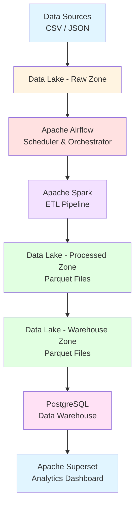

# On-Premise Data Lake with Apache Spark ETL Pipeline


## 📌 Project Summary

This project builds a **complete end-to-end data engineering system** entirely on a local machine—no cloud services used. Raw datasets are stored in a local data lake, processed using **Apache Spark**, scheduled and orchestrated using **Apache Airflow**, and visualized using **Apache Superset**. The project demonstrates a full production-style workflow for data ingestion, transformation, scheduling, and analytics.

## 🏗️ System Architecture



## 🧰 Technology Stack

| Component | Technology | Purpose |
|-----------|-----------|---------|
| **Storage** | Local Filesystem | Data Lake (raw/staging/processed/warehouse) |
| **Processing** | Apache Spark 3.5.0 | ETL transformations and aggregations |
| **Orchestration** | Apache Airflow 2.8.0 | Workflow scheduling and monitoring |
| **Warehouse** | PostgreSQL 13 | Structured data storage |
| **Visualization** | Apache Superset | Interactive dashboards |
| **Language** | Python 3.11 | Scripting and data processing |

## 📂 Project Structure

```
Dm assignment/
├── datalake/                    # Data Lake zones
│   ├── raw/                     # Raw data (CSV, JSON)
│   ├── staging/                 # Intermediate processing
│   ├── processed/               # Cleaned data (Parquet)
│   └── warehouse/               # Analytics data (Parquet)
├── spark/                       # Spark ETL scripts
│   ├── etl_pipeline.py          # Main ETL pipeline
│   ├── config.py                # Configuration
│   └── utils.py                 # Helper functions
├── airflow/                     # Airflow configuration
│   ├── dags/
│   │   └── spark_etl_dag.py     # DAG definition
│   └── docker-compose.yaml      # Airflow Docker setup
├── superset/                    # Superset configuration
│   ├── docker-compose.yaml      # Superset Docker setup
│   └── init_superset.sh         # Initialization script
├── scripts/                     # Utility scripts
│   ├── generate_sample_data.py  # Sample data generator
│   ├── setup_postgres.py        # Database setup
│   └── validate_pipeline.py     # Data validation
├── docs/                        # Documentation
│   ├── architecture.md          # Architecture details
│   └── setup_guide.md           # Setup instructions
├── requirements.txt             # Python dependencies
└── README.md                    # This file
```

## 🚀 Quick Start

### Prerequisites

- **Python 3.11+**
- **Docker Desktop** (for Airflow and Superset)
- **Java 8+** (for Spark)

### Installation Steps

#### 1. Setup Virtual Environment (Recommended)

```powershell
cd "c:\Users\tb619\Videos\Dm assignment"

# Run the automated setup script
.\setup.ps1
```

This script will:
- Create a Python virtual environment
- Upgrade pip
- Install all dependencies from requirements.txt
- Verify the installation

**Manual Setup** (if you prefer):
```powershell
# Create virtual environment
python -m venv venv

# Activate virtual environment
.\venv\Scripts\Activate.ps1

# Upgrade pip
python -m pip install --upgrade pip

# Install dependencies
pip install -r requirements.txt
```

#### 2. Generate Sample Data

```powershell
# Make sure virtual environment is activated
python scripts\generate_sample_data.py
```

This creates:
- `datalake/raw/sales.csv` (10,000 transactions)
- `datalake/raw/products.json` (100 products)
- `datalake/raw/customers.csv` (1,000 customers)

#### 3. Run Spark ETL Pipeline

```bash
python spark/etl_pipeline.py
```

This processes data through:
- **Extract**: Read raw CSV/JSON files
- **Transform**: Clean, join, aggregate data
- **Load**: Write to processed and warehouse zones

#### 4. Validate Pipeline

```bash
python scripts/validate_pipeline.py --stage all
```

#### 5. Start Apache Airflow

```bash
cd airflow
docker-compose up -d
```

Access Airflow at: **http://localhost:8080**
- Username: `admin`
- Password: `admin`

#### 6. Start Apache Superset

```bash
cd superset
docker-compose up -d
```

Access Superset at: **http://localhost:8088**
- Username: `admin`
- Password: `admin`

## 📊 Data Flow

### 1️⃣ Data Ingestion (Raw Zone)

Sample datasets are generated with realistic data:
- **Sales**: Transaction details with dates, products, customers, amounts
- **Products**: Product catalog with categories, prices, suppliers
- **Customers**: Customer demographics and locations

### 2️⃣ Apache Airflow DAG

The DAG automates the entire pipeline:

```python
check_raw_data >> run_spark_etl >> validate_data >> notify_success
```

**Schedule**: Daily at 2:00 AM

### 3️⃣ Spark ETL Pipeline

**Extract Phase**:
- Read CSV and JSON files from raw zone
- Schema inference and validation

**Transform Phase**:
- Remove null/duplicate records
- Data type conversions
- Feature engineering (e.g., `total_amount = quantity × price`)
- Join sales with products and customers
- Create aggregations

**Load Phase**:
- Write cleaned data to `processed/` (Parquet)
- Write analytics data to `warehouse/` (Parquet)
- Optionally load to PostgreSQL

### 4️⃣ Data Warehouse

**Fact Table**:
- `fact_sales`: Transaction-level sales data

**Dimension Tables**:
- `dim_products`: Product catalog
- `dim_customers`: Customer information

**Aggregate Tables**:
- `agg_monthly_revenue`: Monthly sales metrics
- `agg_top_products`: Product performance
- `agg_regional_sales`: Geographic analysis

### 5️⃣ Superset Dashboard

Create visualizations:
- 📊 Revenue by Month (Line Chart)
- 📈 Sales Growth Rate (KPI)
- 🗺️ Sales by Region (Map)
- 📦 Top 10 Products (Bar Chart)
- 👤 Customer Segmentation (Pie Chart)
- 📉 Return Rate Analysis (Time Series)
- 💰 Average Order Value (KPI)
- 🏆 Product Category Performance (Stacked Bar)

## 🔧 Configuration

### Environment Variables

Copy `.env.example` and create `.env`:

```bash
# PostgreSQL
POSTGRES_HOST=localhost
POSTGRES_PORT=5432
POSTGRES_DB=datalake_warehouse
POSTGRES_USER=datalake_user
POSTGRES_PASSWORD=datalake_password

# Spark
SPARK_MASTER=local[*]
SPARK_APP_NAME=DataLakeETL

# Airflow
AIRFLOW_HOME=c:/Users/tb619/Videos/Dm assignment/airflow
```

## 📈 Performance Metrics

| Metric | Value |
|--------|-------|
| Data Processing Time | ~30 seconds |
| Total Records Processed | 10,000+ |
| Parquet Compression Ratio | ~5:1 |
| Pipeline Execution Frequency | Daily |

## 🧪 Testing

### Run Validation

```bash
# Validate all stages
python scripts/validate_pipeline.py --stage all

# Validate specific stage
python scripts/validate_pipeline.py --stage raw
python scripts/validate_pipeline.py --stage processed
python scripts/validate_pipeline.py --stage warehouse
```

### Manual Testing

1. Check Parquet files: `datalake/processed/` and `datalake/warehouse/`
2. Verify Airflow DAG runs successfully
3. Connect Superset to PostgreSQL and query tables

## 📚 Documentation

- [Architecture Details](docs/architecture.md)
- [Setup Guide](docs/setup_guide.md)

## 🎯 Key Features

✅ **Complete Data Lake Architecture** with proper zones (raw/staging/processed/warehouse)  
✅ **Production-Grade ETL** with data quality checks and error handling  
✅ **Automated Orchestration** using Apache Airflow DAGs  
✅ **Scalable Processing** with Apache Spark  
✅ **Interactive Dashboards** using Apache Superset  
✅ **Comprehensive Logging** and monitoring  
✅ **Parquet Optimization** for efficient storage  
✅ **Dimensional Modeling** with fact and dimension tables  

## 🎓 Resume Summary

> Built a complete on-premise data lake with Apache Spark ETL pipeline orchestrated by Apache Airflow and visualized in Apache Superset. Implemented data ingestion from CSV/JSON sources, performed transformations including cleaning, joins, and aggregations, and created a dimensional data warehouse. Automated the entire workflow with daily scheduling and created interactive dashboards for business analytics. Technologies: Python, PySpark, Airflow, PostgreSQL, Superset, Docker.

## 🐛 Troubleshooting

### Spark Issues
- Ensure Java 8+ is installed: `java -version`
- Set `JAVA_HOME` environment variable

### Airflow Issues
- Check Docker is running: `docker ps`
- View logs: `docker-compose logs -f`

### Superset Issues
- Reset admin password: `docker exec superset superset fab reset-password admin`

## 📝 License

This project is for educational purposes.

## 👤 Author

Data Engineering Project - 2024

---

**⭐ If you found this project helpful, please star it!**
