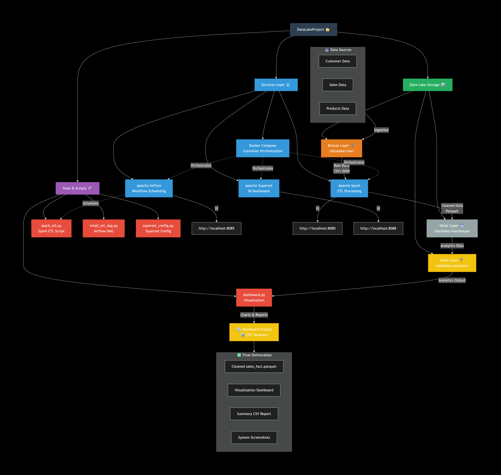

# 🗂️ Retail Data Lake Project (Mini Data Lake for Lab Submission)

This project implements a **simple local Data Lake** using:
- **Apache Spark** → ETL Processing  
- **Airflow** → Workflow Scheduling  
- **Docker Compose** → Container Orchestration  
- **Python (Pandas + Matplotlib)** → Dashboard & Visualizations  

It follows the standard **Bronze → Silver → Gold** data lake architecture.

---

## 📁 Project Structure

```
DataLakeProject/
│── airflow/
│   └── dags/retail_etl_dag.py
│── datalake/
│   ├── raw/          # Bronze: customer, sales, products
│   ├── warehouse/    # Silver: cleaned data
│   └── analytics/    # Gold: analytics data
│── spark/
│   └── spark_etl.py
│── superset/
│   └── superset_config.py
│── dashboard.py
│── docker-compose.yml
└── README.md
```

---

## 🏗️ Technologies Used

| Component | Purpose |
|----------|---------|
| **Spark** | Reads CSV/JSON → Cleans → Writes Parquet |
| **Airflow** | Automatically schedules ETL |
| **Docker Compose** | Runs all services |
| **Pandas + Matplotlib** | Charts & summary dashboard |
| **Parquet** | Final optimized warehouse format |

---

## 🚀 How to Run the Data Lake

### **1️⃣ Start All Services**
```sh
docker compose up -d
```

### **2️⃣ Run Spark ETL Manually**
```sh
docker exec -it spark-master bash
cd /opt/spark/bin
./spark-submit /opt/spark-apps/spark_etl.py
```

ETL Output is stored inside:

```
datalake/warehouse/sales_fact/
```

---

## 📊 Dashboard (Python)

To view analytics:

```sh
python dashboard.py
```

This generates:

- Total Revenue  
- Sales by City Chart  
- Age Distribution Chart  
- `dashboard_summary.csv`

---

## 📡 Airflow (Optional)

Airflow UI runs at:

```
http://localhost:8085
```

Dag location:

```
airflow/dags/retail_etl_dag.py
```

---

## ✅ Final Output Includes

- Cleaned **sales_fact** table (Parquet)
- Visualization dashboard
- Summary CSV report
- Screenshots of Spark UI, Airflow UI, Dashboard

---

## 👨‍💻 Author

**Praveen Agrawal**  
MSc Data Science — IIIT Lucknow  
GitHub: https://github.com/rv-ethereal

---

## 📘 Notes

This project is built for **Lab Submission** and demonstrates:
- ETL
- Data Lake Zones
- Containerization
- Basic Analytics


<h2 align="center">📊 Final Dashboard Output</h2>

<p align="center">
  
</p>

<h2 align="center">🏁 Final Result Snapshot</h2>

<p align="center">
  
</p>


## 🏗️ Project Architecture Diagram


