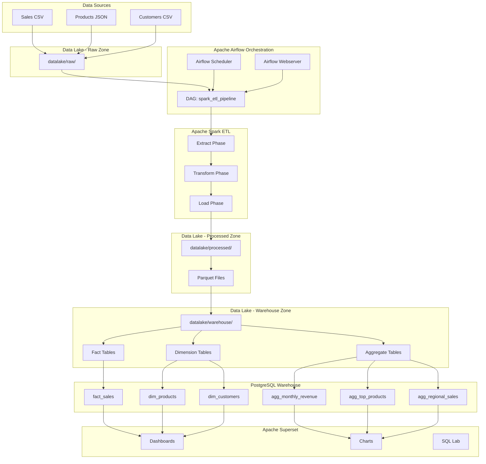

# System Architecture

## Overview

This document provides detailed architecture information for the On-Premise Data Lake project.

## Architecture Diagram

## Data Flow Details

### Phase 1: Data Ingestion

**Input**: Raw data files (CSV, JSON)
**Output**: Files in `datalake/raw/`
**Process**:
1. Sample data generator creates realistic datasets
2. Files are placed in raw zone
3. No transformations applied at this stage

### Phase 2: Orchestration

**Component**: Apache Airflow
**Purpose**: Schedule and monitor ETL pipeline
**DAG Tasks**:
1. `check_raw_data`: Verify raw files exist
2. `run_spark_etl`: Execute Spark pipeline
3. `validate_processed_data`: Check output quality
4. `send_success_notification`: Log completion

### Phase 3: ETL Processing

**Component**: Apache Spark
**Input**: Raw zone files
**Output**: Processed and warehouse zone Parquet files

#### Extract
- Read CSV files with schema inference
- Read JSON files with automatic schema detection
- Validate data structure

#### Transform
- **Data Cleaning**:
  - Remove null values in key columns
  - Drop duplicate records
  - Standardize data types
  
- **Feature Engineering**:
  - Calculate derived fields (e.g., profit margin)
  - Create date components (year, month)
  - Compute totals and aggregates
  
- **Data Integration**:
  - Join sales with products
  - Join sales with customers
  - Create enriched fact table

#### Load
- Write cleaned data to processed zone (Parquet)
- Create fact and dimension tables
- Generate pre-aggregated analytics tables
- Optionally load to PostgreSQL

### Phase 4: Data Warehouse

**Component**: PostgreSQL
**Schema Design**: Star Schema

#### Fact Table
- **fact_sales**: Grain = One row per transaction
  - Transaction details
  - Foreign keys to dimensions
  - Measures (amounts, quantities)

#### Dimension Tables
- **dim_products**: Product attributes
- **dim_customers**: Customer demographics

#### Aggregate Tables
- **agg_monthly_revenue**: Time-series metrics
- **agg_top_products**: Product performance
- **agg_regional_sales**: Geographic analysis

### Phase 5: Visualization

**Component**: Apache Superset
**Data Source**: PostgreSQL warehouse
**Outputs**: Interactive dashboards and charts

## Technology Choices

### Why Apache Spark?
- **Scalability**: Can process large datasets
- **Performance**: In-memory processing
- **Flexibility**: Supports multiple data formats
- **Rich API**: DataFrame API for transformations

### Why Apache Airflow?
- **Scheduling**: Cron-like scheduling with monitoring
- **Dependencies**: Clear task dependency management
- **Monitoring**: Web UI for pipeline visibility
- **Extensibility**: Custom operators and sensors

### Why PostgreSQL?
- **Reliability**: ACID compliance
- **Performance**: Excellent query performance
- **Compatibility**: Works well with Superset
- **Features**: Advanced indexing and views

### Why Apache Superset?
- **Modern UI**: Intuitive dashboard builder
- **SQL Support**: Direct SQL querying
- **Visualization**: Rich chart library
- **Open Source**: Free and customizable

### Why Parquet?
- **Compression**: 5-10x smaller than CSV
- **Performance**: Columnar format for analytics
- **Schema**: Embedded schema information
- **Compatibility**: Widely supported

## Scalability Considerations

### Current Setup (Local)
- **Data Volume**: Up to 10GB
- **Processing**: Single machine
- **Concurrency**: Local executor

### Production Scaling
- **Spark**: Can run on cluster (YARN, Kubernetes)
- **Airflow**: CeleryExecutor for distributed tasks
- **Storage**: Can migrate to HDFS or S3
- **Database**: Can use distributed databases

## Security Considerations

### Current Implementation
- Local network only
- Basic authentication
- Environment variables for credentials

### Production Recommendations
- SSL/TLS encryption
- Role-based access control (RBAC)
- Secrets management (Vault, AWS Secrets)
- Network isolation
- Audit logging

## Monitoring and Logging

### Airflow Monitoring
- Task execution logs
- DAG run history
- Email alerts on failure

### Spark Monitoring
- Application logs
- Data quality metrics
- Processing statistics

### Data Quality Checks
- Null value detection
- Duplicate identification
- Schema validation
- Row count verification

## Disaster Recovery

### Backup Strategy
- Raw data: Keep original files
- Processed data: Can be regenerated
- Database: Regular PostgreSQL backups
- Airflow metadata: Database backups

### Recovery Process
1. Restore raw data files
2. Re-run Spark ETL pipeline
3. Restore database from backup
4. Validate data integrity

## Performance Optimization

### Spark Optimizations
- Adaptive query execution enabled
- Partition coalescing
- Broadcast joins for small tables
- Parquet compression

### Database Optimizations
- Indexes on frequently queried columns
- Materialized views for complex queries
- Connection pooling
- Query optimization

## Future Enhancements

### Potential Improvements
- Real-time streaming with Spark Streaming
- Data quality framework (Great Expectations)
- Machine learning integration
- Cloud deployment option
- CI/CD pipeline
- Automated testing
- Data lineage tracking
- Cost monitoring
